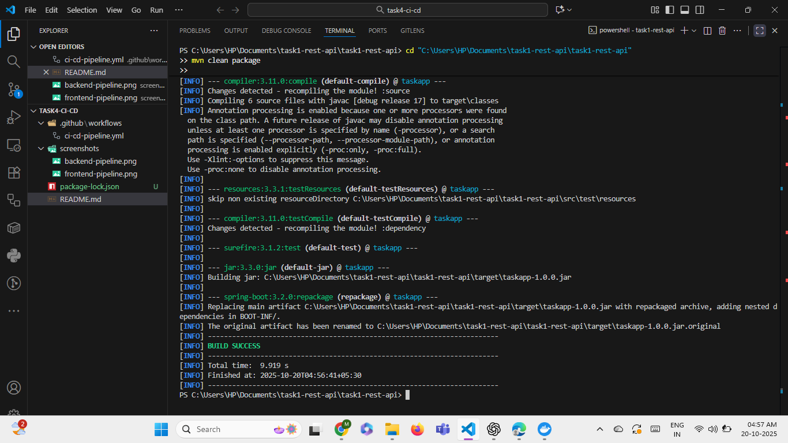
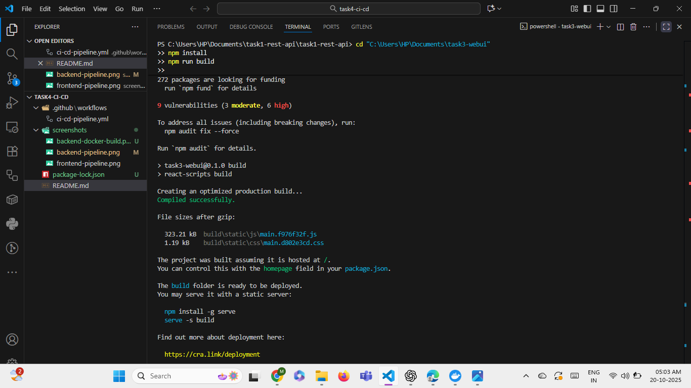

# Task 4 - CI/CD Pipeline

This repository contains the CI/CD pipeline for the Kaiburr 2025 assessment.  
The pipeline builds and Dockerizes both the **Task 1 backend** and **Task 3 frontend**.

---

## 🔧 Pipeline Overview

- Build backend (Java Spring Boot) with Maven
- Build frontend (React + TypeScript) with npm
- Dockerize both backend and frontend
- Push Docker images to Docker Hub

---

## 📸 Screenshots

### Backend CI/CD Pipeline

*Backend build, tests, and Docker image creation.*

### Frontend CI/CD Pipeline

*Frontend build, tests, and Docker image creation.*

---

## 📝 Instructions

1. Clone your backend and frontend repositories locally.
2. Make sure your GitHub secrets are set:
   - `DOCKER_USERNAME`
   - `DOCKER_PASSWORD`
3. Push any changes to `main` branch.
4. Check GitHub Actions tab for pipeline execution.

---

## 👤 Author

**[Your Name]**  

